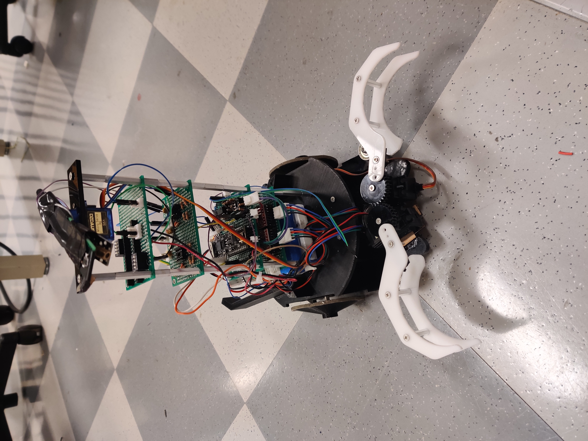
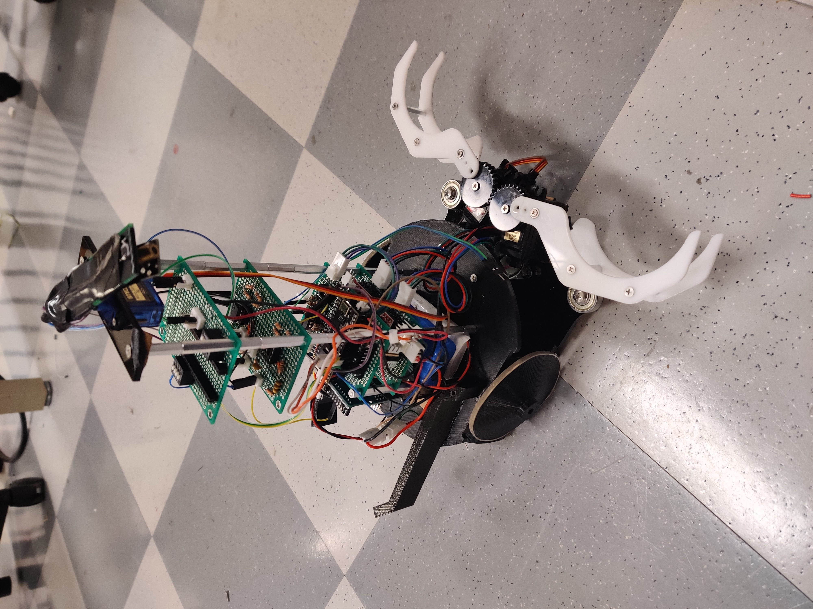
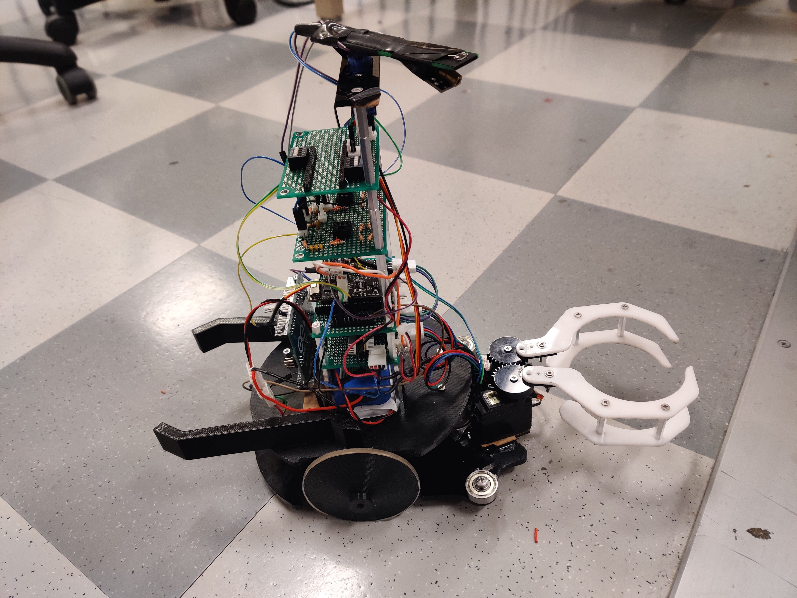

# Autonomous_Battle_bot

This project was done as the part of the course MEAM510 : Design of Mechatronic Systems in UPenn. This project involves designing and manufacturing of a wheeled bot which can carry out the task of grabbing cans from the opponents field. Varied functionalities are implemented on the robot to carry out the desired task autonomously. The robot is also capable of navigating itself to a particular location using VIVE localization system. ESP32 microcontroller was used for driving and grabbing. Wireless communication via HTML(Webpage) and UDP was used to send commands to the robot. ESPnow was also used to communicate between multiple ESP32s.

<table>
  <tr>
      <td align = "center">  </td>
<!--       <td align = "center">  </td> -->
      <td align = "center">  </td>
  </tr>
</table>

The functionalities are listed below:

## Functionality 1: Beacon Tracking
<table>
  <tr>
      <td align = "center">  </td>
      <td> This task required the bot to find the IR light emitting tower.   The IR beacon tower is emitting light at a certain frequency which the bot detects                using an amplification circuit and moves towards it. The circuit designed works over a distance upto 5 mts. For more details, please refer to the report. </td>
  </tr>
  <tr>
      <td align = "center"> Beacon Tracking</td>
  </tr>
</table>

## Functionality 2: Wall Follow

<table>
  <tr>
      <td align = "center">  </td>
      <td> This task required the bot to follow the wall over a decided distance margin.    For more details, please refer to the report.</td>
  </tr>
  <tr>
      <td align = "center"> Wall Following</td>
  </tr>
</table>

## Functionality 3: Vive Can Tracking

<table>
  <tr>
      <td align = "center">  </td>
      <td> This task required the bot to follow the wall over a decided distance margin.    For more details, please refer to the report.</td>
  </tr>
  <tr>
      <td align = "center"> Wall Following</td>
  </tr>
</table>
